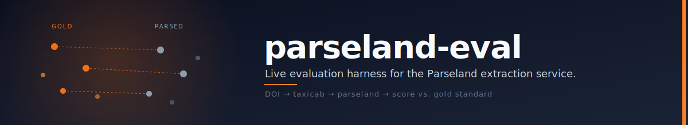

<p align="center">
  
</p>

# parseland-eval

Evaluation harness and dashboard for the deployed [Parseland](https://github.com/ourresearch/parseland-lib) extraction service used by OpenAlex. Scores the live service's output against a hand-annotated gold standard and renders the results on a hosted dashboard.

- **`eval/`** — Python scoring harness (`parseland_eval` package), gold standard data, run artifacts, threshold-tuning tool.
- **`dashboard/`** — React + Vite dashboard, deployed at <https://openalex-parseland-dashboard-fe36c419013c.herokuapp.com/>.

## What it measures

Per field, across the full gold corpus and per-publisher / per-failure-mode slices:

| Field          | Strict                          | Soft / fuzzy                          | Binary                        |
|----------------|---------------------------------|---------------------------------------|-------------------------------|
| Authors        | last-name + first-initial       | rapidfuzz `token_set_ratio` ≥ 85      | P / R / F1 (strict and soft)  |
| Affiliations   | exact string match              | normalized + filler-word-stripped, ≥ 85 | P / R / F1 (three strictnesses) |
| Abstract       | exact string match              | Levenshtein on NFKC-normalized text   | match at `fuzzy_ratio ≥ 0.74` |
| PDF URL        | canonicalized URL equality      | —                                     | micro P / R (excludes "gold has no PDF" rows from the denominator) |

The `0.74` abstract threshold is [data-tuned](#abstract-threshold-tuning), not eyeballed.

## Quickstart

```bash
cd eval
python -m venv .venv && source .venv/bin/activate
pip install -e '.[dev]'

# Run the full eval against the live Parseland service (default source).
python -m parseland_eval run --label my-first-run

# Score a 5-row smoke sample (~5 seconds).
python -m parseland_eval run --label smoke --limit 5
```

Run artifacts land at `eval/runs/<label>-<timestamp>.json` and are automatically indexed in `eval/runs/index.json`, which the dashboard consumes.

## Architecture

```
  gold-standard.json
           │
           ▼
  ┌────────────────────────────────┐
  │ python -m parseland_eval run    │
  │                                 │
  │   for each DOI:                 │
  │     Taxicab → harvest UUID      │
  │     Parseland /parseland/<uuid> │
  │     → extracted metadata        │
  │     score(gold, parsed)          │
  │                                 │
  └────────────────────────────────┘
           │
           ▼
  eval/runs/<label>-<ts>.json
           │
           ▼
  ┌────────────────────────────────┐
  │ React dashboard (Vite)          │
  │  • Scorecard (P / R per field)  │
  │  • Publisher heatmap            │
  │  • Failure-mode bar             │
  │  • Diff table with filters      │
  │  • Trend across runs            │
  └────────────────────────────────┘
```

The runner calls the **live deployed service** — it never runs parseland-lib in-process. If the live API is unreachable, the eval fails loudly rather than silently scoring a different parser.

## Abstract threshold tuning

The abstract's binary `match_at_threshold` flag is gated by `ABSTRACT_MATCH_THRESHOLD` in `eval/parseland_eval/score/abstract.py`, currently **`0.74`**. The value is re-derivable on demand:

```bash
python scripts/tune_abstract_threshold.py
```

Method: largest-gap midpoint of the paired `fuzzy_ratio` distribution, filtered to ratios ≥ 0.5 (the domain floor — below that, fewer than half the characters align and the texts definitionally aren't the same abstract). Otsu's method and KDE-valley are printed alongside for comparison; bootstrap 95% CI indicates whether the recommendation is stable at the current sample size.

Re-run after each meaningful gold-standard expansion and update the constant if the midpoint moves outside the bootstrap CI.

## Dashboard deployment

Heroku auto-deploys from the `main` branch of this repo. To verify after a push:

```bash
git push origin main
sleep 90
curl -sI https://openalex-parseland-dashboard-fe36c419013c.herokuapp.com/ | head -1
```

Do **not** edit or redeploy the stale copies under `parseland-lib/dashboard/` — the `deploy-dashboard.yml` workflow there is disabled and any edits will not ship.

## Repo layout

```
parseland-eval/
├── docs/banner.svg
├── eval/
│   ├── parseland_eval/
│   │   ├── api.py              # Taxicab + Parseland HTTP client
│   │   ├── runner.py           # DOI → live APIs → ParserRun
│   │   ├── cli.py              # `python -m parseland_eval run`
│   │   ├── gold.py             # gold-standard loader + quirks
│   │   ├── report.py           # run JSON writer + index update
│   │   └── score/              # authors, affiliations, abstract, pdf_url, aggregate
│   ├── scripts/
│   │   └── tune_abstract_threshold.py
│   ├── tests/
│   ├── gold-standard.{csv,json,seed.json,holdout.json}
│   └── runs/
├── dashboard/
│   └── src/
│       ├── components/         # Scorecard, PublisherHeatmap, FailureModeBar, DiffRow, DiffTable, TrendChart
│       └── lib/                # Zod schema, formatters, palette
├── CLAUDE.md
└── README.md                   # you are here
```

## Further reading

- [`eval/README.md`](eval/README.md) — deeper scoring/normalization notes, gold-standard quirks.
- [`dashboard/README.md`](dashboard/README.md) — dashboard dev/build workflow.
- [`CLAUDE.md`](CLAUDE.md) — conventions for contributors (human or agent).
